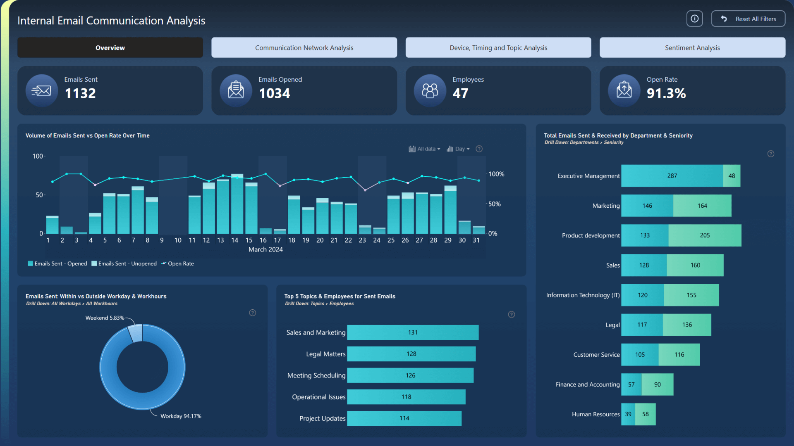

# 2025 年財務報表使用說明

此專案包含貴公司 **2025 年財務報表 Dashboard**。  
請依照以下步驟開啟並查看報表。

## 使用步驟

1. **下載檔案**
   - `sales_dashboard_template.pbit`
   - `Sales_csv.csv`

2. **開啟 Power BI 範本**
   - 以 **Power BI Desktop** 開啟 `sales_dashboard_template.pbit`。

3. **輸入資料路徑**
   - 當系統出現提示視窗時，請將 **CSV 檔案的完整路徑（包含檔名）** 貼入提示方塊。  
   - 例如：
     ```
     C:\Users\YourName\Downloads\Sales_csv.csv
     ```

4. **載入資料**
   - 確認路徑後按下 **Load / 載入**。
   - 系統會自動匯入資料並建立 Dashboard。

5. **查看報表**
   - 載入完成後，即可瀏覽 **2025 年財務報表與相關分析圖表**。

## 介面示意



---

若無法載入資料，請確認：
- `Sales_csv.csv` 檔案存在於輸入的路徑中
- 路徑與檔名拼寫正確
- 使用 **Power BI Desktop** 開啟 `.pbit` 檔案